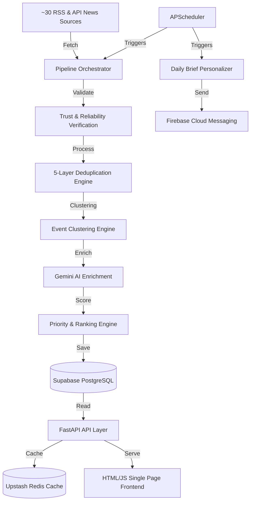

# AI Pulse Codebase Analysis

AI Pulse is a production-ready **Personalized AI News Intelligence Platform** designed to discover, validate, enrich, rank, personalize, and notify users about developments in the AI space.

---

## 🏗️ High-Level System Architecture

The application is structured around a **FastAPI** backend with asynchronous database access via **SQLAlchemy 2.0** and **PostgreSQL (Supabase)**. Real-time caching is handled via **Upstash Redis**, and AI enrichment features utilize **Gemini AI** APIs.

---

## 📁 Repository Directory Structure

The project has a unified backend-driven layout:

*   **`backend/`**: Core API and processing logic.
    *   **`app/`**: Application package.
        *   **`main.py`**: Entry point of the FastAPI application. Sets up middlewares, lifespan events (scheduler starting/stopping, DB hook), and routers.
        *   **`api/`**: Endpoint routing definitions.
            *   **`v1/`**: Version 1 APIs. Includes `auth.py`, `news.py`, `routers.py` (Users, Preferences, Bookmarks, Notifications, Categories, Health, Admin), and `intelligence.py` (Events, Trends, Digests, Suggestions, Search).
        *   **`models/`**: SQLAlchemy declarative ORM models.
        *   **`schemas/`**: Pydantic v2 validation models.
        *   **`services/`**: Core business domain logic, structured into components (caching, AI, deduplication, fetching, etc.).
        *   **`scheduler/`**: Scheduler orchestration jobs (APScheduler).
        *   **`templates/`**: Holds HTML/JS templates, primarily `index.html` (the dashboard UI).
        *   **`utils/`**: Helper methods for text parsing, date normalization, HTTP requests, etc.
    *   **`tests/`**: Unit and integration test suite using `pytest`.

---

## 🗄️ Database Models (`backend/app/models`)

The database architecture consists of 8 main tables defining the AI Pulse domain:

| Model | Table Name | Description | Relationships |
| :--- | :--- | :--- | :--- |
| **`User`** | `users` | User profile and registration tracking. | Bookmarks, notifications, daily briefs, preferences. |
| **`UserPreferences`** | `user_preferences` | User category, company, and topic interests. | 1:1 with `User`. |
| **`NewsSource`** | `news_sources` | Scraper feeds with health metrics (consecutive failures, reliability). | News articles. |
| **`NewsArticle`** | `news_articles` | Raw or duplicate/canonical web pages retrieved from sources. | Event, source, analysis, bookmarks, duplicates. |
| **`NewsAnalysis`** | `news_analyses` | Gemini-enriched metadata for an article (25+ fields). | 1:1 with `NewsArticle`. |
| **`NewsEvent`** | `news_events` | Clustered groups of articles representing a singular news event. | Articles. |
| **`Trend`** | `trends` | Aggregated trending terms (companies, models, topics) over window times. | Related events. |
| **`Bookmark`** | `bookmarks` | Articles saved by users for reading list purposes. | User, article. |
| **`DailyBrief`** | `daily_briefs` | Custom tailored daily feed containing curated article arrays per user. | User. |
| **`Notification`** | `notifications` | FCM push notification log for history and tracking. | User. |

---

## ⚡ Core Processing Pipelines

### 1. The News Pipeline (`backend/app/scheduler/jobs.py`)
Runs periodically (normally at 10:00 AM UTC):
1.  **Ingestion**: `Orchestrator` runs all ~30 source scrapers.
2.  **Verification**: Computes a basic reliability and trust score for each source and article.
3.  **Deduplication**: Runs checks through 5 layers:
    *   Exact URL matching
    *   Punctuation-stripped title hash
    *   Content body snippet hash
    *   Semantic vector distance matching (using Gemini embeddings)
    *   Entity fingerprint intersection
4.  **Clustering**: Matches articles into centralized `NewsEvent` entities.
5.  **AI Enrichment**: Triggers Gemini API to populate the 25 analytical fields in `NewsAnalysis` (including subcategory, event type, key takeaways, affected industries, sentiment, risks, business opportunities, and an importance score).
6.  **Ranking**: Computes weighted scores (`importance × 0.35 + trust × 0.30 + freshness × 0.20 + official × 0.15`) for final feed prioritization.

### 2. Daily Brief & Notification Delivery
*   Runs shortly after the main pipeline.
*   Determines personalization arrays for each user based on category/topic subscriptions and bookmarks.
*   Saves the resulting custom feed to `DailyBrief`.
*   Triggers Firebase Cloud Messaging (FCM) notifications to notify users.

---

## 📡 API Services (`backend/app/api/v1`)

The API exposes endpoints covering:
1.  **Auth & Profiles**: Signup, login, JWT management, and profile metadata.
2.  **Bookmarks & Preferences**: Managing reading lists, tag subscriptions, and custom weights.
3.  **News Articles**: Retrieval of recent articles, trending articles, and detailed article profiles (with full AI analyses).
4.  **Intelligence Engine (`intelligence.py`)**:
    *   `/events`: Paginated event listings sorted by priority.
    *   `/trends`: Emerging entities (companies, models, topics, keywords) across 6-hour, 24-hour, and 7-day windows.
    *   `/digest`: Unified Daily AI Industry Digest.
    *   `/weekly-brief`: Rolling 7-day executive briefing generated by Gemini.
    *   `/suggestions`: Custom suggestions endpoint implementing two types:
        *   `personalized`: Mentorship advice generated via Gemini using user preferences/bookmarks context.
        *   `market`: Venture-capital scale development recommendations.
    *   `/search`: Semantic and keyword search utilising embedding distances.

---

## 🎨 Frontend Client

The frontend is a single-page reactive application embedded inside `backend/app/templates/index.html`. It relies on Vanilla JS to interact with the backend FastAPI services, rendering the daily digest, search, bookmarks, user settings, personalization feeds, and trending signals.
